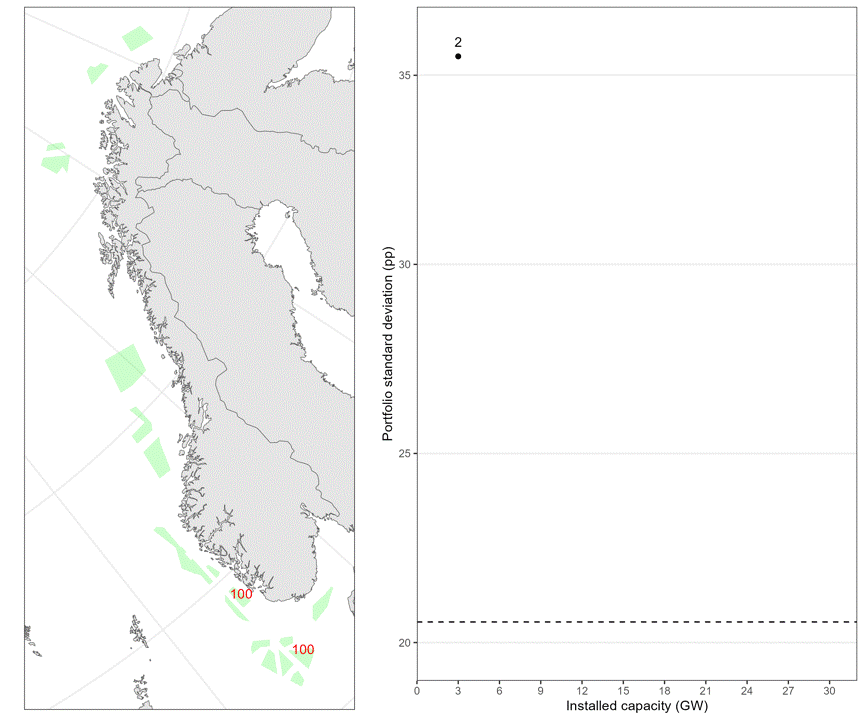

Optimal allocation of 30GW offshore wind power in the Norwegian Economic
Zone
================

*Contributors: Sondre Hølleland†1, Geir Drage
Berentsen1, Håkon Otneim1, Ida Marie
Solbrekke2.*

*† Responsible for the code.*

1 *Norwegian School of Economics, Norway.*

2 *Forecast Engine, Norwegian research centre (NORCE),
Norway*

*Correspondance to: <sondre.holleland@nhh.no>*

This github repository contains the necessary code for reproducing the
modern portfolio analysis performed in the paper *Optimal allocation of
30GW offshore wind power in the Norwegian Economic Zone*.

### Data

The full NORA3-WP dataset (Solberg and Sorteberg, 2022) is available at
<https://archive.sigma2.no/pages/public/datasetDetail.jsf?id=10.11582/2021.00068>.
The extracted sample for the 40 locations used in the paper is published
here in agreement with the authors.

### Animation of sequential build out for the NVE regions

## Author’s github account

**Sondre Hølleland** - [holleland](https://github.com/holleland)

## License

This project is licensed under [CC BY 4.0 LEGAL
CODE](https://creativecommons.org/licenses/by/4.0/legalcode), same as
the NORA3-WP data.

## References

- Ida Marie Solbrekke and Asgeir Sorteberg. [NORA3-WP: A high-resolution
  offshore wind power dataset for the Baltic, North, Norwegian, and
  Barents Seas](https://www.nature.com/articles/s41597-022-01451-x).
  Scientific Data, 9(1):362, December 2022.
